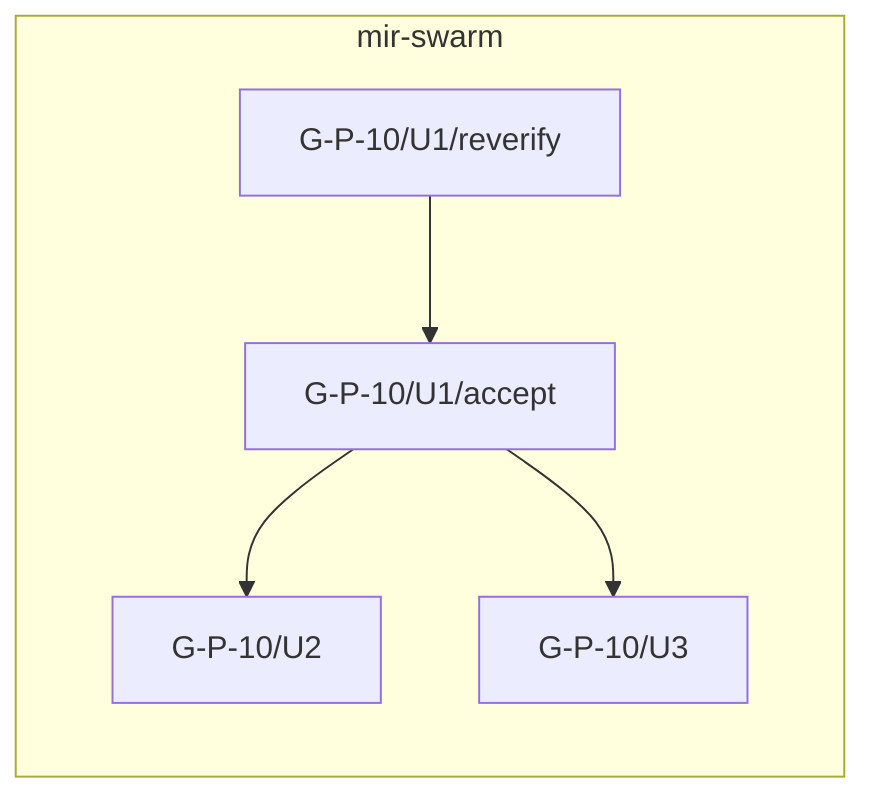

# Goal: Import Mermaid Work Graphs Into Vivi

## Summary

Add first-class executable work graphs to project-local Vivi. A Mind must be
able to submit one Mermaid flowchart that names arbitrary work nodes and their
dependency edges. Vivi validates and imports the complete graph atomically,
assigns durable handles, tracks node state, and continuously reports the ready
frontier. The Mind may later add or revise open nodes and edges without
reconstructing the graph from chat context.

Fleet tasks remain bounded role assignments. They execute graph nodes; they do
not define the durable work topology.

## Problem

Vivi 6.4 supports repeatable `task send --depends-on`, plus `task list
--blocked` and `--blocking`. That surface records dependencies between existing
tasks, but it does not provide an operational graph:

- `vivi board` does not show task dependencies, blocked reasons, successors,
  or the ready frontier.
- `blocked` is a filtered query derived from unfinished task headers. It is not
  a complete project-wide graph view.
- Fleet's `fleet.py prepare --depends-on` records and later validates prepared
  assignment chains, but `claim` does not enforce dependency readiness and
  `settle` does not activate successors.
- Campaign goals, planning passes, gates, delivery documents, and delivery
  units are not necessarily Vivi tasks.
- Minds currently invent useful codes such as `SC-001`, `G-P-10/U1`, and
  `hir-lean/P2`, then preserve their ordering in prose, Markdown tables, or
  working memory.
- A runtime completion tells the Mind that one assignment ended. It does not
  answer which work is now eligible across all active campaigns.

Large Fleet waves expose two related graphs:

1. The planning workflow, such as Forge, Mind disposition, Check, audit,
   correction, Delivery, delivery audit, and admission.
2. The product delivery graph, such as `U1 -> U2 -> U3`, including fan-in,
   fan-out, and cross-goal dependencies.

These graphs are real control-plane state. Leaving them only in prose makes the
Mind reconstruct ordering after compaction and makes independent inspection
unnecessarily difficult.

## Goal Boundary

Vivi becomes the durable authority for imported work-graph topology and live
node state inside one project mailspace. Mermaid is the human- and LLM-facing
authoring and projection syntax. Fleet remains responsible for selecting a
ready node, choosing a role and runtime, preparing the assignment, and proving
its claim and settlement chain.

The central invariant is:

> Vivi determines which work is eligible. The Mind determines what to dispatch
> now and to whom. Fleet proves how the dispatched work was executed.

## Goals

- Import a complete Mermaid `flowchart` into Vivi in one atomic operation.
- Accept arbitrary Mind-defined node codes without assigning product meaning to
  their spelling.
- Give every graph and node an immutable Vivi handle.
- Store normalized nodes and directed dependency edges in the project-local
  mailspace database.
- Derive `ready` and `blocked` from graph topology and node state.
- Show ready work, blocked work, prerequisites, and successors in text and
  stable JSON.
- Support graph-wide queries and a compact graph projection on `vivi board`.
- Preserve the imported Mermaid source and a content hash as revision evidence.
- Support atomic later additions and revisions through another Mermaid apply,
  while also allowing small explicit node and edge additions.
- Bind one or more concrete task attempts to a logical graph node without
  making task ownership part of the graph definition.
- Emit durable events when graph revisions land, node state changes, or new
  nodes enter the ready frontier.
- Export the current graph back to Mermaid with optional state styling.
- Provide a clean adapter surface for Fleet's `prepare -> claim -> settle ->
  advance` chain.

## Non-goals

- No general-purpose business-process language or arbitrary code execution.
- No automatic agent spawn, model selection, branch selection, or write-scope
  collision decision inside Vivi.
- No attempt to infer a reliable execution graph from unstructured campaign or
  delivery prose.
- No replacement of campaign goals or delivery documents as specification
  authorities.
- No requirement that every ordinary standalone task belong to a graph.
- No cyclic execution-history graph in the first version.
- No conditional-expression language in the first version. Explicit Mind
  disposition and acceptance nodes represent branching decisions.
- No cross-mailspace transaction. Multi-fleet portfolio views may aggregate
  independent graphs, but each project remains its own durability boundary.
- No requirement to parse every Mermaid feature, diagram kind, styling
  directive, or extension.

## Ground Truth Researched

- `src/cli/mailspace_command.rs`: `TaskSendCommand` accepts repeatable
  `--depends-on`; task list exposes `--blocked` and `--blocking` filters.
- `src/mailspace/delivery.rs`: task dependencies are repeated
  `X-Vivi-Depends-On` headers; blocked state is derived by checking whether
  referenced handles are in `done`.
- `src/local_board_command.rs`: `BoardItem` contains handle, date, sender,
  subject, and last event, but no dependency or graph fields.
- `src/mailspace/trace.rs`: `vivi trace` builds a communication graph from
  replies, citations, and copy relationships. It is evidence and
  communication topology, not an executable work graph.
- `src/storage/schema.rs`: project-local SQLite schema and migration authority.
- `src/storage/events.rs`: durable mailspace event recording and query
  patterns.
- `docs/release-v6.4.0.md`: released task-dependency behavior that graph work
  must preserve for standalone tasks.
- Fleet `scripts/fleet.py`: `prepare` forwards dependency handles and writes
  sidecar receipts; `advance` recursively validates settled chains but does not
  schedule successors.
- MIR Swarm Wave 0 and Wave 2 evidence: planning pipelines and delivery-unit
  DAGs are currently durable Markdown artifacts but not queryable Vivi state.

## Conceptual Model

### Graph

A graph has an immutable handle, a project-unique code, a current revision, a
status, and source evidence. A graph code might be `mir-swarm-wave-2` or
`swift-codegen`.

### Node identity

Each node has three distinct identifiers:

| Field | Purpose |
| --- | --- |
| Vivi handle | Immutable database identity and edge target |
| Mermaid source ID | Stable key used to reconcile later imports |
| Code or label | Arbitrary operator-facing name such as `G-P-10/U1/accept` |

Edges use immutable handles internally. Re-import reconciliation uses the
Mermaid source ID, never the mutable label.

### Node lifecycle

The stored lifecycle is initially:

```text
open -> active -> done
  |        |
  +------> deferred | cancelled | superseded
```

`ready` and `blocked` are derived projections of an open node:

- Ready: every incoming prerequisite edge is satisfied.
- Blocked: at least one incoming prerequisite edge is unsatisfied.

A finished task attempt does not automatically mean the logical node is
satisfied. A review may settle with `residual` or `block_ship`; an explicit
disposition, repair, re-audit, or acceptance node can remain open.

### Edges

The first version needs one canonical execution relation:

```text
A --> B means B requires A to be done.
```

`A blocks B` is the inverse projection of the same edge, not a second mutable
relationship. Descriptive edge labels may be retained for display but do not
change execution semantics in the first version.

### Task binding

A graph node may have zero or more task attempts. The binding records the task
handle, role, attempt state, and receipt references. A node can exist before a
role or task is selected. Repairs and retries append attempts or explicit new
nodes; they do not rewrite settled history.

## Mermaid Import Contract

Support a deliberately narrow, documented Mermaid profile:

- `flowchart` / `graph` with one direction declaration.
- Node declarations with stable source IDs and quoted labels.
- Directed `-->` edges and chained edges.
- `subgraph` blocks as grouping and display metadata.
- Comments and visual classes may be preserved or ignored safely.
- Other diagram types and executable directives are rejected.

Example:



Import is a compile-and-commit operation:

1. Parse the entire source without changing state.
2. Validate IDs, endpoints, supported syntax, and acyclicity.
3. Produce a node/edge/revision diff.
4. Assign immutable handles to new objects.
5. Commit the revision, topology, and events in one SQLite transaction.
6. Recalculate the ready frontier.
7. Emit one revision event and any resulting readiness events.

If any step fails, the graph remains unchanged.

## Mutation And Revision Rules

- A repeated import with the same graph code is an explicit apply operation,
  not an implicit destructive replacement.
- The apply preview reports added, changed, removed, and invalid operations.
- Open, unassigned nodes may be edited or removed.
- Active nodes may not acquire or lose prerequisites.
- Done nodes and their incoming edges are immutable history.
- New successors may be appended to active or done nodes.
- Replaced work is superseded by a new node; historical nodes remain
  inspectable.
- Re-applying identical Mermaid is idempotent and creates no semantic revision.
- Small `node add` and `edge add` commands use the same validation and
  transaction path as bulk apply.

## Target CLI Surface

Names may be refined during delivery, but the capability boundary is:

```text
vivi graph import --code <graph> --file <path> [--check]
vivi graph apply <graph> --file <path> [--check]
vivi graph show <graph> [--json|--mermaid] [--include-state]
vivi graph ready [<graph>] [--json]
vivi graph blocked [<graph>] [--json]
vivi graph node show <graph>:<source-id>
vivi graph node add ...
vivi graph edge add ...
vivi graph activate <node> --task <task-handle>
vivi graph complete <node> --task <task-handle> --note <evidence>
vivi board --graph
```

`--check` is mandatory before any bulk mutation path is trusted by Fleet. Text
output serves operators; JSON is the stable agent and script contract.

## Fleet Integration Contract

The companion Fleet change should let the Mind prepare a ready graph node:

```text
fleet.py prepare --node <graph>:<source-id> --to <role> --pass <pass> ...
```

The adapter must:

1. Resolve the graph node and refuse blocked, active, terminal, or superseded
   work.
2. Create the role-addressed Vivi task and bind its handle as an attempt.
3. Preserve Fleet's frozen scope, role binding, claim, report, and repository
   receipts.
4. Mark the node active only after the assignment is prepared and claimed.
5. Settle the attempt without bypassing explicit review, disposition, or
   acceptance nodes.
6. Recalculate readiness and wake the Mind through normal board/runtime event
   handling.

Vivarium supplies the generic graph capability. Fleet owns its workflow
template, pass vocabulary, and assignment policy. Fleet integration is a
companion delivery in the Fleet repository, not a reason to encode Fleet roles
inside Vivi core.

## Architecture Direction

- Extend the existing project-local `mail.sqlite`; do not create a second
  coordination database.
- Store normalized graph, revision, node, edge, task-binding, and graph-event
  records behind `Storage` APIs.
- Keep Mermaid as import/export evidence rather than querying or reparsing it
  for every readiness calculation.
- Reuse existing handle resolution, JSON conventions, event recording, and
  project discovery.
- Keep standalone `X-Vivi-Depends-On` task behavior intact. Graph-managed task
  dependencies should be derived from or linked to the canonical graph rather
  than becoming a second graph authority.
- Keep production errors in `VivariumError`; use `clap` derive; avoid panics.
- Add no parser dependency until delivery proves the supported subset cannot be
  implemented safely with existing crates and the standard library.

## Initial Factory Phases

### Phase 1: Graph foundation and atomic Mermaid import

- Add the graph schema and storage APIs.
- Define the supported Mermaid profile and parser.
- Implement `graph import --check`, atomic import, `graph show`, and stable JSON.
- Prove duplicate, missing-endpoint, cycle, rollback, and idempotency behavior.

### Phase 2: Lifecycle, frontier, and controlled apply

- Implement node state transitions and ready/blocked calculation.
- Implement atomic graph apply plus node/edge append commands.
- Freeze active and completed history according to the mutation rules.
- Export normalized topology and optional live state to Mermaid.

### Phase 3: Board, events, and task binding

- Add graph frontier summaries to `vivi board --graph`.
- Add task-attempt binding and durable graph lifecycle events.
- Ensure completion recalculates successors without automatically spawning a
  runtime.
- Add watch/delta coverage for newly ready nodes.

### Phase 4: Fleet companion adoption

- Update Fleet's helper and protocol in the Fleet repository.
- Prepare, claim, and settle imported nodes through existing receipt chains.
- Exercise one planning pipeline and one fan-out delivery graph end to end.
- Keep the cross-repository change as its own reviewed and committed delivery.

## Acceptance Criteria

- A Mind can import a Mermaid graph containing arbitrary node labels and
  directed dependencies with one command.
- Invalid input causes no partial graph, node, edge, revision, or event writes.
- A successful import returns the graph handle, revision, counts, roots, and
  initial ready frontier in text and JSON.
- Re-applying identical source is idempotent.
- Stable Mermaid source IDs retain Vivi node handles across label changes and
  additive revisions.
- An open node is reported ready exactly when all prerequisites are done.
- Completing a fan-out prerequisite exposes every qualified successor.
- Queries explain why blocked nodes are blocked and what a completed node
  unlocks.
- Active and completed prerequisites cannot be rewritten silently.
- `vivi graph export --mermaid --include-state` produces valid, LLM-readable
  Mermaid representing the normalized graph and current state.
- `vivi board --graph --json` exposes graph, node, code, lifecycle state,
  blocked-by handles, and successor handles without removing existing board
  fields.
- Standalone task dependencies introduced in 6.4 continue to work.
- A Fleet companion can bind a ready node to one task attempt and cannot claim
  a blocked node.
- `cargo fmt --check`, `cargo test --test hygiene`,
  `cargo test --test local_mailspace_cli`, and `cargo test` pass for each
  Vivarium implementation phase.

## Validation

- Parser unit tests for supported and rejected Mermaid forms.
- Storage tests for transaction rollback, revision history, handle stability,
  idempotency, and lifecycle invariants.
- CLI integration tests using temporary project mailspaces.
- A fan-out fixture: `verify -> accept -> {U2, U3}`.
- A fan-in fixture: `{A, B} -> integrate`.
- A mutation fixture that appends successors to a done node while rejecting a
  changed prerequisite.
- JSON snapshot assertions for import diff, ready, blocked, show, and board
  projections.
- Manual round trip: import Mermaid, export Mermaid with state, and re-import
  the normalized topology without semantic change.
- Companion Fleet smoke: prepare a ready node, claim and settle its task, then
  observe the successor enter the frontier.

## Release Posture

Graph schema and CLI work merit a minor release after Vivarium Phases 1 through
3 pass broad validation. The Fleet companion may follow in the same coordinated
release window, but publication and push remain operator decisions.

The release note must distinguish executable work graphs from the existing
`vivi trace` communication graph and task-only dependency filters.

## Exit Strategy

- Graphs are opt-in; ordinary tasks remain usable without graph membership.
- An imported graph may be closed or archived without deleting its history.
- If the Mermaid profile proves too broad, narrow accepted syntax and keep JSON
  plus normalized export stable rather than weakening validation.
- If Fleet adoption reveals missing workflow semantics, add explicit node kinds
  or disposition nodes through a versioned schema change. Do not make task Done
  silently mean accepted.

## Open Questions

1. **Command split:** `graph import` for creation and `graph apply` for later
   revisions, or one idempotent `graph apply` command? Recommendation: keep both
   verbs so first creation cannot silently target the wrong graph.
2. **Code lookup:** should arbitrary labels be unique? Recommendation: require
   source ID uniqueness and treat labels as non-unique display text; allow
   lookup by qualified source ID.
3. **Subgraph meaning:** namespace or display group? Recommendation: display
   group metadata only. The top-level Vivi graph code is the namespace.
4. **Conditional transitions:** import labeled edges as executable guards?
   Recommendation: preserve labels as metadata and use explicit disposition
   nodes in the first version.
5. **Task completion:** may a bound task automatically complete its node?
   Recommendation: only when the node's declared completion policy is task-done;
   review and gate nodes require their explicit outcome or disposition.

These defaults are sufficient for delivery planning unless repository evidence
reveals a conflicting invariant.

## Stop Conditions

- Stop if the implementation would make Mermaid text, task headers, and graph
  tables competing mutable authorities for the same edge set.
- Stop if bulk apply can partially mutate a graph on validation or transaction
  failure.
- Stop if a blocked node can be prepared or claimed without an explicit
  recovery override and durable event.
- Stop if changing a completed node or incoming edge can rewrite historical
  execution evidence.
- Stop if the first version requires a general expression evaluator or
  executable Mermaid directives.
- Stop before adding cross-mailspace transactions or automatic agent spawning.

## Supporting Skills

- `factory`: supervise phased implementation, verification, review, polish,
  commits, and release checkpoints.
- `delivery`: compile each phase into a repo-aware delivery document before
  implementation.
- `correctness`: audit lifecycle transitions, transactions, readiness, and
  mutation invariants.
- `cleanliness`: keep parser, storage, graph domain, and CLI rendering
  boundaries small.
- `polish`: perform the required per-file refinement before each phase closes.
- `auditor`: independently review graph semantics and Fleet integration before
  release.
